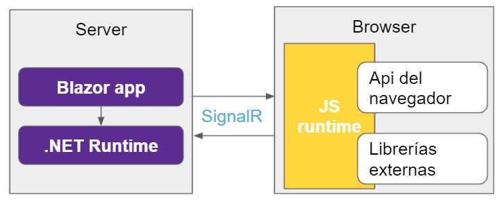

# Interoperabilidad de JavaScript en Blazor

## Índice

- [Introducción](#introducción)
- [Ejemplo 1. Llamar a una función JavaScript que no devuelve nada desde Blazor](#ejemplo-1-llamar-a-una-función-javascript-que-no-devuelve-nada-desde-blazor)
- [Ejemplo 2. Llamar a una función JavaScript que devuelve un valor desde Blazor](#ejemplo-2-llamar-a-una-función-javascript-que-devuelve-un-valor-desde-blazor)
- [Ejemplo 3. Llamar a un método estático C# desde JavaScript](#ejemplo-3-llamar-a-un-método-estático-c-desde-javascript)
- [Ejemplo 4. Utilizar JavaScript de terceros en Blazor](#ejemplo-4-utilizar-javascript-de-terceros-en-blazor)
- [Ejercicio 1. Llamada a una función JavaScript que devuelve un valor desde Blazor](#ejercicio-1-llamada-a-una-función-javascript-que-devuelve-un-valor-desde-blazor)
- [Ejercicio 2. Visualización de gráficos con Chart.js y selección de tipo de gráfico](#ejercicio-2-visualización-de-gráficos-con-chartjs-y-selección-de-tipo-de-gráfico)
- [Ejercicio 3. Corrija el ejercicio 5](#ejercicio-3-corrija-el-ejercicio-5)
- [Ejercicio 4. Contador animado](#ejercicio-4-contador-animado)
- [Referencias](#referencias)

## Introducción

Aunque Blazor permite desarrollar aplicaciones web completas utilizando únicamente **C#** y **.NET**, en muchos casos es necesario interactuar con **código JavaScript** para aprovechar todo el potencial del entorno web moderno.

Esta capacidad de comunicación entre ambos lenguajes se conoce como **interoperabilidad JavaScript (JS Interop)**.

Blazor abstrae muchas funcionalidades del navegador mediante su propio modelo de componentes y eventos, pero **no sustituye completamente el ecosistema JavaScript**.

Existen librerías y APIs del navegador que solo están disponibles mediante JavaScript, como:

- **APIs del DOM** (manipulación directa de elementos HTML).
- **Librerías de visualización** (Chart.js, Leaflet, D3.js, etc.).
- **Integraciones de terceros** (Google Maps, Stripe, PayPal, etc.).
- **Funciones del navegador** como notificaciones, geolocalización o almacenamiento local.



*Imagen 1. Imagen obtenida de [NetMentor](https://www.netmentor.es/entrada/javascript-interop)*

En esta práctica vamos a ver cómo podemos integrar JavaScript en una aplicación Blazor Server utilizando la interoperabilidad de JavaScript que nos ofrece Blazor.

Todos los ejemplos se van a realizar en un mismo proyecto **Blazor Server** que vamos a llamar `BlazorAppJS`.

## Ejemplo 1. Llamar a una función JavaScript que no devuelve nada desde Blazor

**Paso 1. Crear el archivo JavaScript**

Dentro de la carpeta `wwwroot`, vamos a crear un directorio llamado `js` y dentro de este directorio vamos a crear un archivo llamado `mi_javascripts.js` con el siguiente contenido:

```javascript
// Función asignada al objeto window como propiedad global
window.mostrarMensaje = (nombre) => {
    console.log(`Hola desde JavaScript, ${nombre}`);
    alert(`Hola ${nombre}, este mensaje viene de JavaScript`);
}
```

**Paso 2. Incluir el archivo JavaScript en el proyecto**

Edita el archivo `App.razor` para incluir el archivo JavaScript que acabamos de crear antes de la etiqueta de cierre `</body>`:

```html
<script src="js/mi_javascripts.js"></script>
```

**Paso 3. Crear el componente Blazor para llamar a JavaScript**

Crea un nuevo componente Razor llamado `EjemploJS1.razor` en la carpeta `Pages` con el siguiente contenido:

```razor
@page "/ejemplojs1"
@rendermode InteractiveServer
@inject IJSRuntime JS

<h3>Ejemplo 1. Ejecutar una función JavaScript desde Blazor</h3>

<input @bind="nombre" placeholder="Escribe tu nombre" class="form-control" />

<button class="btn btn-primary mt-2" @onclick="MostrarMensaje">
    Llamar a JavaScript
</button>


@code {
    private string nombre = "";

    private async Task MostrarMensaje()
    {
        // Llama a una función JS que no devuelve nada (void)
        await JS.InvokeVoidAsync("mostrarMensaje", nombre);
    }
}
```

Observe que al inicio del componente hemos utilizado las directivas: `@rendermode InteractiveServer` y `@inject IJSRuntime JS`.

En los componentes de Blazor, estas dos líneas son fundamentales cuando queremos ejecutar código JavaScript desde C# o manejar interacciones dinámicas en la interfaz.

### **`@rendermode InteractiveServer`**

Esta directiva indica cómo se renderiza el componente y dónde se ejecuta su lógica. Le estamos diciendo a Blazor que el componente funcionará en modo interactivo del lado del servidor.

Esto significa que:

- El código C# del componente se ejecuta en el **servidor**,
- El navegador se comunica en tiempo real con el servidor a través de **SignalR**,
- Los eventos como `@onclick`, las actualizaciones de datos y las llamadas JavaScript se procesan de forma **reactiva e inmediata**.


*Imagen 2. Imagen obtenida de [Microsoft](https://learn.microsoft.com/es-es/aspnet/core/blazor/hosting-models?view=aspnetcore-9.0)*

Si no incluimos esta directiva, el componente se renderiza como HTML estático (sin conexión activa), por lo que:

- No podríamos manejar eventos como `@onclick`,
- Ni ejecutar llamadas JavaScript desde C#.

### **`@inject IJSRuntime JS`**

La palabra clave `@inject` permite **inyectar servicios** en un componente Razor. En este caso, significa que estamos solicitando a Blazor que nos proporcione una instancia del servicio `IJSRuntime`, el cual permite **interactuar con JavaScript desde C#**.

Si no se inyecta `IJSRuntime`, el componente no tendría acceso al entorno de ejecución JavaScript, y cualquier intento de llamar a una función JS produciría un error de compilación.

### `InvokeVoidAsync`

El método `InvokeVoidAsync` se utiliza para llamar a una función JavaScript que **no devuelve ningún valor** (es decir, una función que retorna `void` en C#).

**Ejemplo:**

```csharp
await JS.InvokeVoidAsync("mostrarMensaje", nombre);
```

### `InvokeAsync<T>`

Cuando queramos llamar a una función JS que **devuelve un valor**, utilizamos el método `InvokeAsync<T>`, donde `T` es el tipo de dato que esperamos recibir.

**Ejemplo:**

```csharp
string fecha = await JS.InvokeAsync<string>("obtenerFechaActual");
```

**Paso 4. Modifique el archivo de navegación**

Añada un enlace al nuevo componente `EjemploJS1` en el archivo `Components/Layout/NavMenu.razor`.

---

## Ejemplo 2. Llamar a una función JavaScript que devuelve un valor desde Blazor

**Paso 1. Añadir la función JavaScript que devuelve un valor**

Vamos a editar el archivo que contiene el código JavaScript de nuestro proyecto `wwwroot/js/mi_javascripts.js`, para añadir las funciones necesarias para crear y eliminar el gráfico:

```javascript
// Función que devuelve un string a C#
window.obtenerFechaActual = () => {
    const hoy = new Date();
    return hoy.toLocaleString();
}
```

**Paso 2. Incluir el archivo JavaScript en el proyecto**

En el paso anterior, modificamos el archivo `App.razor` para incluir el archivo JavaScript que contiene nuestro código, antes de la etiqueta de cierre `</body>`:

```html
<script src="js/mi_javascripts.js"></script>
```

> **Nota:** Si la etiqueta ya existe no es necesario añadirla de nuevo.

**Paso 3. Crear el componente Blazor para llamar a JavaScript**

Crea un nuevo componente Razor llamado `EjemploJS2.razor` en la carpeta `Pages` con el siguiente contenido:

```razor
@page "/ejemplojs2"
@rendermode InteractiveServer
@inject IJSRuntime JS

<h3>Ejemplo 2. Ejecutar una función JavaScript desde Blazor</h3>

<button class="btn btn-secondary mt-2" @onclick="ObtenerFecha">
    Obtener fecha actual desde JavaScript
</button>

<p class="mt-3">Fecha actual: @fecha</p>

@code {
    private string fecha = "";

    private async Task ObtenerFecha()
    {
        // Llama a una función JS que devuelve un valor
        fecha = await JS.InvokeAsync<string>("obtenerFechaActual");
    }
}
```

**Paso 4. Modifique el archivo de navegación**

Añada un enlace al nuevo componente `EjemploJS2` en el archivo `Components/Layout/NavMenu.razor`.

---

### Ejemplo 3. Llamar a un método estático C# desde JavaScript

**Paso 1. Crear el componente Blazor para ser llamado desde JavaScript**

Crea un nuevo componente Razor llamado `EjemploJS3.razor` en el directorio `Pages` con el siguiente contenido:

```razor
@page "/ejemplojs3"
@rendermode InteractiveServer
@inject IJSRuntime JS

<h3>Ejemplo 3. Llamar a un método de C# desde JavaScript</h3>
<p>Seguimiento del ratón con JS y C#</p>
<p>Posición: X=@x, Y=@y</p>

@code {
    private int x, y;

    [JSInvokable]
    public void ActualizarPosicion(int posX, int posY)
    {
        x = posX;
        y = posY;
        StateHasChanged();
    }

    protected override async Task OnAfterRenderAsync(bool firstRender)
    {
        if (firstRender)
            await JS.InvokeVoidAsync("iniciarSeguimientoRaton", DotNetObjectReference.Create(this));
    }
}
```

### El atributo `[JSInvokable]`

El atributo `[JSInvokable]` se utiliza para marcar un método en C# que puede ser invocado desde JavaScript.

En nuestro caso, añadimos el atributo al método `ActualizarPosicion`:

```csharp
[JSInvokable]
public void ActualizarPosicion(int posX, int posY)
{
    x = posX;
    y = posY;
    StateHasChanged();
}
```

Este método recibe dos parámetros enteros que representan las coordenadas X e Y del ratón, actualiza las variables `x` e `y`, y llama a `StateHasChanged()` para que Blazor **actualice la interfaz de usuario con la nueva posición**.

### El método `OnAfterRenderAsync`

El método `OnAfterRenderAsync` se utiliza para realizar acciones después de que el componente ha sido renderizado en el navegador. El parámetro `firstRender` asegura que el código solo se ejecute una vez, cuando el componente se carga por primera vez.

```chsarp
protected override async Task OnAfterRenderAsync(bool firstRender)
{
    if (firstRender)
        await JS.InvokeVoidAsync("iniciarSeguimientoRaton", DotNetObjectReference.Create(this));
}
```

En este método se llama a la función JavaScript `iniciarSeguimientoRaton`, pasando una referencia al objeto .NET actual (`this`) con `DotNetObjectReference.Create(this)`. Esta referencia (`DotNetObjectReference`) permite que el código JavaScript pueda llamar métodos de esta instancia concreta del componente.

**Paso 2. Añadir la función JavaScript que hace llamada a un método de C#**

Vamos a editar el archivo que contiene el código JavaScript de nuestro proyecto `wwwroot/js/mi_javascripts.js`, para añadir la función necesaria para llamar al método de C#:

```javascript
// Función JavaScript que llama a un método de C#
window.iniciarSeguimientoRaton = (dotnetRef) => {
    document.addEventListener('mousemove', (e) => {
        dotnetRef.invokeMethodAsync('ActualizarPosicion', e.clientX, e.clientY);
    });
}
```

Vamos a analizar qué realiza esta función:

- El parámetro `dotNetObj` es la referencia a la instancia C# que recibió `DotNetObjectReference.Create(this)`.
- Cada vez que el usuario mueve el ratón, el evento `mousemove` se dispara.
- El script llama al método de C# `ActualizarPosicion` pasando las coordenadas X y Y.

**Paso 3. Incluir el archivo JavaScript en el proyecto**

Edita el archivo `App.razor` para incluir el archivo JavaScript que acabamos de crear antes de la etiqueta de cierre `</body>`:

```html
<script src="js/mi_javascripts.js"></script>
```

> **Nota:** Si la etiqueta ya existe no es necesario añadirla de nuevo.

**Paso 4. Modifique el archivo de navegación**

Añada un enlace al nuevo componente `EjemploJS3` en el archivo `Components/Layout/NavMenu.razor`.

---

## Ejemplo 4. Utilizar JavaScript de terceros en Blazor

En este ejemplo vamos a utilizar la librería de JavaScript [Chart.js](https://www.chartjs.org) para mostrar un gráfico de barras en un componente Blazor.

**Paso 1. Añadir la librería Chart.js al proyecto**

Edita el archivo `App.razor` para incluir la librería [Chart.js](https://www.chartjs.org) antes de la etiqueta de cierre `</body>`:

```html
<script src="https://cdn.jsdelivr.net/npm/chart.js"></script>
```

**Paso 2. Añadir las funciones JavaScript para crear y eliminar el gráfico**

Vamos a editar el archivo que contiene el código JavaScript de nuestro proyecto `wwwroot/js/mi_javascripts.js`, para añadir las funciones necesarias para crear y eliminar el gráfico:


```javascript
// Referencia: https://www.telerik.com/blogs/blazor-basics-blazor-javascript-interop-calling-javascript-net

function createChart(htmlElementId, data, label) {
    new Chart(
        document.getElementById(htmlElementId),
        {
            type: 'bar',
            data: {
                labels: data.map(row => row.year),
                datasets: [
                    {
                        label: label,
                        data: data.map(row => row.salary)
                    }
                ]
            },
            options: {
                scales: {
                    y: {
                        beginAtZero: true
                    }
                }
            },
        }
    );
}

function disposeChart(htmlElementId) {
    const chartStatus = Chart.getChart(htmlElementId);
    if (chartStatus != undefined) {
        chartStatus.destroy();
    }
}
```

**Paso 3. Crear el componente Blazor para mostrar el gráfico**

Crea un nuevo componente Razor llamado `EjemploJS4.razor` en el directorio `Pages` con el siguiente contenido:

```razor
@page "/ejemplojs4"
@rendermode InteractiveServer
@inject IJSRuntime JS
@implements IAsyncDisposable    // Indica que el componente puede liberar recursos de forma asíncrona

<h1>Using Charts.js from Blazor!</h1>

<div style="width: 800px; height: 400px">
    <canvas id="@HtmlElementId"></canvas>
</div>

@code {
    // Identificador único para el elemento HTML del gráfico
    public string HtmlElementId { get; set; } = $"chart_{Guid.NewGuid()}";
    
    // Definimos un tipo de dato inmutable para los datos del gráfico
    public record LineChartData(int Year, int Salary);

    // Lista con datos de ejemplo para el gráfico
    public LineChartData[] Data { get; set; } = [
        new LineChartData(2019, 65_400),
        new LineChartData(2020, 69_600),
        new LineChartData(2021, 72_250),
        new LineChartData(2022, 76_800),
        new LineChartData(2023, 92_400),
        new LineChartData(2024, 96_180),
        new LineChartData(2025, 103_500)
    ];

    // Indicador para saber si la interoperabilidad con JavaScript está disponible
    private bool JavaScriptInteropAvailable = false;

    protected async override Task OnAfterRenderAsync(bool firstRender)
    {
        if (!firstRender)
        {
            // Llamamos a la función JavaScript disposeChart para eliminar el gráfico anterior antes de crear uno nuevo
            await JS.InvokeVoidAsync("disposeChart", new object[] { HtmlElementId });
        }
        else
        {
            // En el primer renderizado, indicamos que la interoperabilidad con JavaScript está disponible
            JavaScriptInteropAvailable = true;
        }

        // Llamamos a la función JavaScript createChart para crear el gráfico con los datos proporcionados
        await JS.InvokeVoidAsync("createChart", new object[] { HtmlElementId, Data, "Salario por año" });
    }

    // Esta función se ejecuta cuando el componente deja de existir en la interfaz.
    // Llamamaos a la función JavaScript disposeChart para limpiar los recursos asociados al gráfico.
    public async ValueTask DisposeAsync()
    {
        if (JavaScriptInteropAvailable)
        {
            await JS.InvokeVoidAsync("disposeChart", new object[] { HtmlElementId });
        }
    }
}
```


**Paso 4. Modifique el archivo de navegación**

Añada un enlace al nuevo componente `EjemploJS4` en el archivo `Components/Layout/NavMenu.razor`.

---

## Ejemplo 5. Interacción JavaScript pura dentro de un componente Blazor

A continuación, se muestra un ejemplo de cómo podemos incluir código JavaScript directamente dentro de un componente Blazor, aunque no es la forma recomendada de integrar JavaScript en Blazor.

Algunos de los motivos por los que se recomienda hacerlo así es porque:

- Blazor no detecta que ese elemento tiene lógica asociada en JavaScript. No puede actualizarlo, eliminarlo ni limpiar recursos correctamente.
- Si el código crece, mezclar JavaScript dentro del HTML complica depuración y mantenimiento.

**Código Razor del componente EjemploJS5.razor:**

```razor
@page "/ejemplojs5"
@rendermode InteractiveServer

<h3>Ejemplo 5</h3>
<p>Duplica texto</p>

<div class="mb-3">
    <input id="texto1" onkeyup="duplicaTexto('texto1','texto2')" class="form-control" />
    <label id="texto2" class="mt-3" />
</div>

@code {

}
```

Observe que en el campo de entrada hemos añadido el evento `onkeyup` que llama a la función JavaScript `duplicaTexto`, pasando los identificadores de los dos elementos HTML.

**Código JavaScript que se llama en el evento `onkeyup` del componente**

```javascript
// Función que duplica el texto de un campo de entrada en otro elemento
window.duplicaTexto = (entrada, salida) => {
    // Operador ?. : Evita error si el elemento no existe (no intenta acceder a .value de null)
    // Operador ?? : Si el valor es null o undefined, reemplaza por una cadena vacía ('')
    const valor = document.getElementById(entrada)?.value ?? '';
    const elemento = document.getElementById(salida);
    if (!elemento) return;
    elemento.innerHTML = ' ' + valor;
}
```

---

## Ejemplo 6. Uso de APIs del navegador

En este ejemplo vamos a ver cómo utilizar una **API nativa del navegador** desde un componente Blazor mediante **interoperabilidad con JavaScript**.

Vamos a utilizar la API de **geolocalización** (`Geolocation API`) para obtener la posición actual del usuario (latitud y longitud) y mostrarla en pantalla.

**Paso 1. Añadir la función JavaScript que accede a la API del navegador**

Edita el archivo `wwwroot/js/mi_javascripts.js` y añade la siguiente función:

```javascript
// Función que utiliza la API de geolocalización del navegador
// y envía los datos de latitud y longitud a un método C# del componente
window.obtenerUbicacion = async (dotnetRef) => {
    if (!navigator.geolocation) {
        alert("La geolocalización no está disponible en este navegador.");
        return;
    }

    navigator.geolocation.getCurrentPosition(
        pos => {
            // Llama al método C# pasando las coordenadas obtenidas
            dotnetRef.invokeMethodAsync("MostrarUbicacion", pos.coords.latitude, pos.coords.longitude);
        },
        err => {
            alert("No se pudo obtener la ubicación: " + err.message);
        }
    );
};
```

Comentarios sobre el código:

* `navigator.geolocation.getCurrentPosition()` es una API propia del navegador que solicita permiso al usuario para acceder a su ubicación.
* Si el permiso se concede, ejecuta la función de éxito, que obtiene la latitud y longitud.
* Luego, la función JavaScript llama al método C# `MostrarUbicacion` mediante `dotnetRef.invokeMethodAsync(...)`.
* Si hay un error (por ejemplo, el usuario deniega el permiso), muestra un mensaje de alerta.


**Paso 2. Crear el componente Blazor**

Crea un nuevo componente llamado `EjemploJS6.razor` en la carpeta `Pages` con el siguiente contenido:

```razor
@page "/ejemplojs6"
@rendermode InteractiveServer
@inject IJSRuntime JS

<h3>Ejemplo 6. Uso de APIs del navegador</h3>
<p>Obtener la ubicación actual del usuario mediante la API de geolocalización</p>

<button class="btn btn-primary" @onclick="ObtenerUbicacion">
    Obtener ubicación
</button>

<p class="mt-3">
    Coordenadas: @coordenadas
</p>

@code {
    private string coordenadas = "Sin datos";

    // Método invocado desde JavaScript con las coordenadas obtenidas
    [JSInvokable]
    public void MostrarUbicacion(double lat, double lon)
    {
        coordenadas = $"Latitud: {lat:F6}, Longitud: {lon:F6}";
        StateHasChanged(); // Actualiza la interfaz
    }

    // Método que inicia la solicitud de ubicación llamando a la función JS
    private async Task ObtenerUbicacion()
    {
        await JS.InvokeVoidAsync("obtenerUbicacion", DotNetObjectReference.Create(this));
    }
}
```

Explicación del código:

1. **`[JSInvokable]`**
   Permite que el método C# `MostrarUbicacion` pueda ser llamado desde JavaScript.
   Este método recibe los valores de latitud y longitud, los guarda en una variable y actualiza la interfaz.

2. **`DotNetObjectReference.Create(this)`**
   Crea una referencia al componente actual que puede ser pasada a JavaScript.
   De esta forma, el código JS puede llamar a métodos de **esta instancia concreta** del componente.

3. **`InvokeVoidAsync("obtenerUbicacion", ...)`**
   Llama a la función JavaScript que accede a la API del navegador.


**Paso 3. Incluir el archivo JavaScript en el proyecto**

Asegúrate de que el archivo `mi_javascripts.js` está incluido en `App.razor`, justo antes de la etiqueta `</body>`:

```html
<script src="js/mi_javascripts.js"></script>
```

> **Nota:** Si ya lo habías agregado en ejemplos anteriores, no es necesario repetirlo.

**Paso 4. Modificar el archivo de navegación**

Añade un enlace al nuevo componente en `Components/Layout/NavMenu.razor`:

```razor
<NavLink class="nav-link" href="ejemplojs6">
    <span class="oi oi-map-marker" aria-hidden="true"></span> EjemploJS6
</NavLink>
```

**Nota sobre seguridad y permisos**

* Los navegadores modernos **solo permiten la geolocalización en contextos seguros (HTTPS)** o en `localhost` durante el desarrollo.
* Si se ejecuta desde un servidor HTTP, la API fallará automáticamente por motivos de privacidad.

---

## Ejemplo 7. Modificar elementos del DOM desde JavaScript

En este ejemplo aprenderemos a **manipular directamente elementos HTML (DOM)** desde **JavaScript**, invocando las funciones correspondientes desde un componente **Blazor** mediante **interoperabilidad (JS Interop)**.

Este tipo de interacción es muy común cuando necesitamos realizar efectos visuales, animaciones, cambios de estilo o manipulación directa de etiquetas HTML que no están controladas por el sistema de renderizado de Blazor.

**Paso 1. Añadir las funciones JavaScript que modifican el DOM**

Edita el archivo `wwwroot/js/mi_javascripts.js` y añade el siguiente código:

```javascript
// Cambia el color del texto de un elemento con el id indicado
window.cambiarColor = (elementId, color) => {
    const elemento = document.getElementById(elementId);
    if (elemento)
        elemento.style.color = color;
};

// Cambia el tamaño de la fuente de un elemento
window.cambiarTamaño = (elementId, size) => {
    const elemento = document.getElementById(elementId);
    if (elemento)
        elemento.style.fontSize = size + "px";
};

// Cambia el contenido de texto de un elemento
window.actualizarTexto = (elementId, texto) => {
    const elemento = document.getElementById(elementId);
    if (elemento)
        elemento.innerText = texto;
};
```

Comentarios sobre el código:

* Cada función utiliza `document.getElementById()` para acceder al elemento HTML correspondiente.
* Se comprueba que el elemento exista antes de modificarlo.
* Las funciones cambian propiedades del **DOM** directamente: color, tamaño de fuente y contenido del texto.

**Paso 2. Crear el componente Blazor**

Crea un nuevo componente Razor llamado `EjemploJS7.razor` en la carpeta `Pages` con el siguiente contenido:

```razor
@page "/ejemplojs7"
@rendermode InteractiveServer
@inject IJSRuntime JS

<h3>Ejemplo 7. Modificar elementos del DOM desde JavaScript</h3>
<p>Interacción entre Blazor y el DOM mediante funciones JavaScript</p>

<div class="mb-3">
    <p id="parrafo" class="border p-2">Texto de ejemplo</p>

    <div class="input-group mb-2">
        <input @bind="nuevoTexto" placeholder="Nuevo texto" class="form-control" />
        <button class="btn btn-secondary" @onclick="ActualizarTexto">Actualizar texto</button>
    </div>

    <div class="input-group mb-2">
        <input @bind="color" placeholder="Color (por ejemplo: red, blue, green)" class="form-control" />
        <button class="btn btn-secondary" @onclick="CambiarColor">Cambiar color</button>
    </div>

    <div class="input-group mb-2">
        <input @bind="tamano" type="number" placeholder="Tamaño en px" class="form-control" />
        <button class="btn btn-secondary" @onclick="CambiarTamano">Cambiar tamaño</button>
    </div>
</div>

@code {
    private string nuevoTexto = "";
    private string color = "";
    private int tamano = 16;

    private async Task ActualizarTexto()
    {
        await JS.InvokeVoidAsync("actualizarTexto", "parrafo", nuevoTexto);
    }

    private async Task CambiarColor()
    {
        await JS.InvokeVoidAsync("cambiarColor", "parrafo", color);
    }

    private async Task CambiarTamano()
    {
        await JS.InvokeVoidAsync("cambiarTamaño", "parrafo", tamano);
    }
}
```

Observe el uso de `@bind` para enlazar los valores de los campos de entrada a las variables C#.

**Paso 3. Incluir el archivo JavaScript en el proyecto**

Asegúrate de que el archivo `mi_javascripts.js` esté referenciado en el archivo `App.razor`, antes del cierre de `</body>`:

```html
<script src="js/mi_javascripts.js"></script>
```

> **Nota:** Si ya fue agregado en ejemplos anteriores, no es necesario añadirlo de nuevo.

**Paso 4. Modificar el archivo de navegación**

Añade el nuevo enlace al componente `EjemploJS7` en `Components/Layout/NavMenu.razor`:

```razor
<div class="nav-item px-3">
    <NavLink class="nav-link" href="ejemplojs7">
        <span class="bi bi-list-nested-nav-menu" aria-hidden="true"></span> EjemploJS7
    </NavLink>
</div>        
```

---

## Ejemplo 8. Almacenamiento local del navegador con localStorage

En este ejemplo aprenderemos a **guardar y recuperar información en el navegador** utilizando la API `localStorage` mediante funciones JavaScript invocadas desde Blazor.

El almacenamiento local del navegador (`localStorage`) permite **guardar datos de forma persistente** en el dispositivo del usuario, incluso después de cerrar la pestaña o el navegador.
A diferencia de las cookies, los datos almacenados aquí **no se envían al servidor**.

**Paso 1. Añadir las funciones JavaScript para gestionar el almacenamiento local**

Edita el archivo `wwwroot/js/mi_javascripts.js` y añade las siguientes funciones:

```javascript
// Guarda un valor en el almacenamiento local
window.guardarDato = (clave, valor) => {
    localStorage.setItem(clave, valor);
};

// Lee un valor del almacenamiento local
window.leerDato = (clave) => {
    return localStorage.getItem(clave);
};

// Elimina un valor del almacenamiento local
window.eliminarDato = (clave) => {
    localStorage.removeItem(clave);
};
```

Comentarios sobre el código:

* `localStorage.setItem(clave, valor)` guarda un dato.
* `localStorage.getItem(clave)` recupera un valor previamente guardado.
* `localStorage.removeItem(clave)` elimina una entrada concreta del almacenamiento local.
* Los datos se guardan como **pares clave–valor** en formato texto (`string`).


**Paso 2. Crear el componente Blazor**

Crea un nuevo componente Razor llamado `EjemploJS8.razor` en la carpeta `Pages` con el siguiente contenido:

```razor
@page "/ejemplojs8"
@rendermode InteractiveServer
@inject IJSRuntime JS

<h3>Ejemplo 8. Almacenamiento local del navegador con localStorage</h3>
<p>Guardar y recuperar datos usando JavaScript desde Blazor</p>

<div class="mb-3">
    <input @bind="clave" placeholder="Clave" class="form-control mb-2" />
    <input @bind="valor" placeholder="Valor a guardar" class="form-control mb-2" />

    <button class="btn btn-primary me-2" @onclick="GuardarDato">Guardar dato</button>
    <button class="btn btn-success me-2" @onclick="LeerDato">Leer dato</button>
    <button class="btn btn-danger" @onclick="EliminarDato">Eliminar dato</button>

    <p class="mt-3"><strong>Resultado:</strong> @resultado</p>
</div>

@code {
    private string clave = "";
    private string valor = "";
    private string resultado = "";

    private async Task GuardarDato()
    {
        if (!string.IsNullOrWhiteSpace(clave))
        {
            await JS.InvokeVoidAsync("guardarDato", clave, valor);
            resultado = $"Dato guardado correctamente con la clave '{clave}'";
        }
        else
        {
            resultado = "Debe introducir una clave.";
        }
    }

    private async Task LeerDato()
    {
        if (!string.IsNullOrWhiteSpace(clave))
        {
            var valorLeido = await JS.InvokeAsync<string>("leerDato", clave);
            resultado = valorLeido != null
                ? $"Valor almacenado: {valorLeido}"
                : "No se encontró ningún dato con esa clave.";
        }
        else
        {
            resultado = "Debe introducir una clave.";
        }
    }

    private async Task EliminarDato()
    {
        if (!string.IsNullOrWhiteSpace(clave))
        {
            await JS.InvokeVoidAsync("eliminarDato", clave);
            resultado = $"Dato eliminado para la clave '{clave}'.";
        }
        else
        {
            resultado = "Debe introducir una clave.";
        }
    }
}
```

Comentarios sobre el código:

1. **Entradas de datos**
   El usuario introduce una **clave** y un **valor**, que luego se almacenan en el `localStorage`.

2. **Funciones en C#**

   * `GuardarDato()` → llama a la función JS `guardarDato`.
   * `LeerDato()` → usa `InvokeAsync<string>` para obtener el valor guardado.
   * `EliminarDato()` → elimina la entrada correspondiente.

3. **`InvokeVoidAsync` vs `InvokeAsync<T>`**

   * Se usa `InvokeVoidAsync` cuando la función JavaScript **no devuelve nada**.
   * Se usa `InvokeAsync<string>` cuando **sí devuelve un valor** (como en `leerDato`).

**Paso 3. Incluir el archivo JavaScript en el proyecto**

Asegúrate de que el archivo `mi_javascripts.js` está referenciado en el archivo `App.razor`, antes del cierre de `</body>`:

```html
<script src="js/mi_javascripts.js"></script>
```

> **Nota:** No repitas la inclusión si ya fue agregada en ejemplos anteriores.

**Paso 4. Añadir el enlace al menú de navegación**

Edita el archivo `Components/Layout/NavMenu.razor` y añade un enlace al nuevo componente:

```razor
<div class="nav-item px-3">
    <NavLink class="nav-link" href="ejemplojs8">
        <span class="bi bi-list-nested-nav-menu" aria-hidden="true"></span> EjemploJS8
    </NavLink>
</div>        
```

**Ventajas del uso de `localStorage`**

* Los datos **persisten entre sesiones** del navegador.
* No requieren conexión con el servidor.
* Son muy útiles para guardar:

  * Preferencias del usuario (tema, idioma, color, etc.)
  * Últimos valores introducidos en formularios.
  * Datos temporales de trabajo offline.

**Nota de seguridad**

Aunque `localStorage` es práctico, **no debe usarse para almacenar información sensible** (como contraseñas o tokens de autenticación), ya que cualquier script del sitio web puede acceder a él.

---

## Ejercicio 1. Llamada a una función JavaScript que devuelve un valor desde Blazor

En este ejercicio, deberá crear un componente Blazor que permita al usuario introducir dos números en dos campos de texto, y al hacer clic en un botón llame a una función JavaScript que sume esos dos números y devuelva el resultado para mostrarlo en pantalla.

---

### Ejercicio 2. Visualización de gráficos con Chart.js y selección de tipo de gráfico

Modifica el componente del Ejemplo 4 para que el usuario pueda seleccionar el tipo de gráfico que desea visualizar antes de renderizarlo. Deberá mostrar una lista de opciones de tipos de gráficos (line, bar, radar, doughnut, pie, polarArea, bubble, scatter) y actualizar la función JavaScript `createChart` para que acepte un parámetro adicional que indique el tipo de gráfico a crear.

---

### Ejercicio 3. Corrija el ejercicio 5

Corrija el componente del Ejemplo 5 para que utilice la interoperabilidad de JavaScript de Blazor en lugar de incluir el código JavaScript directamente en el HTML del componente.

---

### Ejercicio 4. Contador animado

---

# Referencias

- [Interoperabilidad de JavaScript en Blazor de ASP.NET Core (interoperabilidad de JS)](https://learn.microsoft.com/es-es/aspnet/core/blazor/javascript-interoperability/?view=aspnetcore-9.0). Microsoft Ignite.