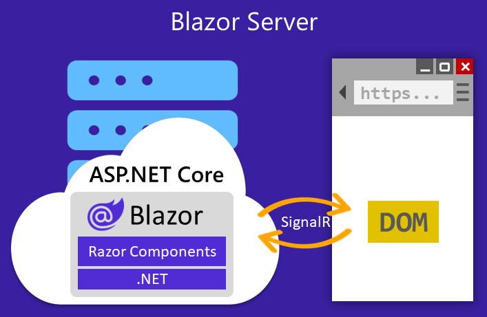

# Interoperabilidad de JavaScript en Blazor

Aunque Blazor permite desarrollar aplicaciones web completas utilizando únicamente **C#** y **.NET**, en muchos casos es necesario interactuar con **código JavaScript** para aprovechar todo el potencial del entorno web moderno.

Esta capacidad de comunicación entre ambos lenguajes se conoce como **interoperabilidad JavaScript (JS Interop)**.

Blazor abstrae muchas funcionalidades del navegador mediante su propio modelo de componentes y eventos, pero **no sustituye completamente el ecosistema JavaScript**.

Existen librerías y APIs del navegador que solo están disponibles mediante JavaScript, como:

- **APIs del DOM** (manipulación directa de elementos HTML).
- **Librerías de visualización** (Chart.js, Leaflet, D3.js, etc.).
- **Integraciones de terceros** (Google Maps, Stripe, PayPal, etc.).
- **Funciones del navegador** como notificaciones, geolocalización o almacenamiento local.


*Imagen 1. Imagen obtenida de [NetMentor](https://www.netmentor.es/entrada/javascript-interop)*

En esta práctica vamos a ver cómo podemos integrar JavaScript en una aplicación Blazor Server utilizando la interoperabilidad de JavaScript que nos ofrece Blazor.

Todos los ejemplos se van a realizar en un mismo proyecto **Blazor Server** que vamos a llamar `BlazorAppJS`.

## Ejemplo 1. Llamar a una función JavaScript que no devuelve nada desde Blazor

**Paso 1. Crear el archivo JavaScript**

Dentro de la carpeta `wwwroot`, vamos a crear un directorio llamado `js` y dentro de este directorio vamos a crear un archivo llamado `mi_javascripts.js` con el siguiente contenido:

```javascript
// Función asignada al objeto window como propiedad global
window.mostrarMensaje = (nombre) => {
    console.log(`Hola desde JavaScript, ${nombre}`);
    alert(`Hola ${nombre}, este mensaje viene de JavaScript`);
}
```

**Paso 2. Incluir el archivo JavaScript en el proyecto**

Edita el archivo `App.razor` para incluir el archivo JavaScript que acabamos de crear antes de la etiqueta de cierre `</body>`:

```html
<script src="js/mi_javascripts.js"></script>
```

**Paso 3. Crear el componente Blazor para llamar a JavaScript**

Crea un nuevo componente Razor llamado `EjemploJS1.razor` en la carpeta `Pages` con el siguiente contenido:

```razor
@page "/ejemplojs1"
@rendermode InteractiveServer
@inject IJSRuntime JS

<h3>Ejemplo 1. Ejecutar una función JavaScript desde Blazor</h3>

<input @bind="nombre" placeholder="Escribe tu nombre" class="form-control" />

<button class="btn btn-primary mt-2" @onclick="MostrarMensaje">
    Llamar a JavaScript
</button>


@code {
    private string nombre = "";

    private async Task MostrarMensaje()
    {
        // Llama a una función JS que no devuelve nada (void)
        await JS.InvokeVoidAsync("mostrarMensaje", nombre);
    }
}
```

Observe que al inicio del componente hemos utilizado las directivas: `@rendermode InteractiveServer` y `@inject IJSRuntime JS`.

En los componentes de Blazor, estas dos líneas son fundamentales cuando queremos ejecutar código JavaScript desde C# o manejar interacciones dinámicas en la interfaz.

### **`@rendermode InteractiveServer`**

Esta directiva indica cómo se renderiza el componente y dónde se ejecuta su lógica. Le estamos diciendo a Blazor que el componente funcionará en modo interactivo del lado del servidor.

Esto significa que:

- El código C# del componente se ejecuta en el **servidor**,
- El navegador se comunica en tiempo real con el servidor a través de **SignalR**,
- Los eventos como `@onclick`, las actualizaciones de datos y las llamadas JavaScript se procesan de forma **reactiva e inmediata**.



*Imagen 2. Imagen obtenida de [Microsoft](https://learn.microsoft.com/es-es/aspnet/core/blazor/hosting-models?view=aspnetcore-9.0)*

Si no incluimos esta directiva, el componente se renderiza como HTML estático (sin conexión activa), por lo que:

- No podríamos manejar eventos como `@onclick`,
- Ni ejecutar llamadas JavaScript desde C#.

### **`@inject IJSRuntime JS`**

La palabra clave `@inject` permite **inyectar servicios** en un componente Razor. En este caso, significa que estamos solicitando a Blazor que nos proporcione una instancia del servicio `IJSRuntime`, el cual permite **interactuar con JavaScript desde C#**.

Si no se inyecta `IJSRuntime`, el componente no tendría acceso al entorno de ejecución JavaScript, y cualquier intento de llamar a una función JS produciría un error de compilación.

### `InvokeVoidAsync`

El método `InvokeVoidAsync` se utiliza para llamar a una función JavaScript que **no devuelve ningún valor** (es decir, una función que retorna `void` en C#).

**Ejemplo:**

```csharp
await JS.InvokeVoidAsync("mostrarMensaje", nombre);
```

### `InvokeAsync<T>`

Cuando queramos llamar a una función JS que **devuelve un valor**, utilizamos el método `InvokeAsync<T>`, donde `T` es el tipo de dato que esperamos recibir.

**Ejemplo:**

```csharp
string fecha = await JS.InvokeAsync<string>("obtenerFechaActual");
```

**Paso 4. Modifique el archivo de navegación**

Añada un enlace al nuevo componente `EjemploJS1` en el archivo `Components/Layout/NavMenu.razor`.

---

## Ejemplo 2. Llamar a una función JavaScript que devuelve un valor desde Blazor

**Paso 1. Añadir la función JavaScript que devuelve un valor**

Dentro de la carpeta `wwwroot`, vamos a crear un directorio llamado `js` y dentro de este directorio vamos a crear un archivo llamado `mi_javascripts.js` con el siguiente contenido:

> **Nota:** Si el archivo ya existe, simplemente añade la siguiente función al final del archivo.

```javascript
// Función que devuelve un string a C#
window.obtenerFechaActual = () => {
    const hoy = new Date();
    return hoy.toLocaleString();
}
```

**Paso 2. Incluir el archivo JavaScript en el proyecto**

Edita el archivo `App.razor` para incluir el archivo JavaScript que acabamos de crear antes de la etiqueta de cierre `</body>`:

```html
<script src="js/mi_javascripts.js"></script>
```

> **Nota:** Si la etiqueta ya existe no es necesario añadirla de nuevo.

**Paso 3. Crear el componente Blazor para llamar a JavaScript**

Crea un nuevo componente Razor llamado `EjemploJS2.razor` en la carpeta `Pages` con el siguiente contenido:

```razor
@page "/ejemplojs2"
@rendermode InteractiveServer
@inject IJSRuntime JS

<h3>Ejemplo 2. Ejecutar una función JavaScript desde Blazor</h3>

<button class="btn btn-secondary mt-2" @onclick="ObtenerFecha">
    Obtener fecha actual desde JavaScript
</button>

<p class="mt-3">Fecha actual: @fecha</p>

@code {
    private string fecha = "";

    private async Task ObtenerFecha()
    {
        // Llama a una función JS que devuelve un valor
        fecha = await JS.InvokeAsync<string>("obtenerFechaActual");
    }
}
```

**Paso 4. Modifique el archivo de navegación**

Añada un enlace al nuevo componente `EjemploJS1` en el archivo `Components/Layout/NavMenu.razor`.

---

### Ejemplo 3. Llamar a un método estático C# desde JavaScript

**Paso 1. Crear el componente Blazor para ser llamado desde JavaScript**

Crea un nuevo componente Razor llamado `EjemploJS3.razor` en el directorio `Pages` con el siguiente contenido:

```razor
@page "/ejemplojs3"
@rendermode InteractiveServer
@inject IJSRuntime JS

<h3>Ejemplo 3. Llamar a un método de C# desde JavaScript</h3>
<p>Seguimiento del ratón con JS y C#</p>
<p>Posición: X=@x, Y=@y</p>

@code {
    private int x, y;

    [JSInvokable]
    public void ActualizarPosicion(int posX, int posY)
    {
        x = posX;
        y = posY;
        StateHasChanged();
    }

    protected override async Task OnAfterRenderAsync(bool firstRender)
    {
        if (firstRender)
            await JS.InvokeVoidAsync("iniciarSeguimientoRaton", DotNetObjectReference.Create(this));
    }
}
```

### El atributo `[JSInvokable]`

El atributo `[JSInvokable]` se utiliza para marcar un método en C# que puede ser invocado desde JavaScript.

En nuestro caso, añadimos el atributo al método `ActualizarPosicion`:

```csharp
[JSInvokable]
public void ActualizarPosicion(int posX, int posY)
{
    x = posX;
    y = posY;
    StateHasChanged();
}
```

Este método recibe dos parámetros enteros que representan las coordenadas X e Y del ratón, actualiza las variables `x` e `y`, y llama a `StateHasChanged()` para que Blazor **actualice la interfaz de usuario con la nueva posición**.

### El método `OnAfterRenderAsync`

El método `OnAfterRenderAsync` se utiliza para realizar acciones después de que el componente ha sido renderizado en el navegador. El parámetro `firstRender` asegura que el código solo se ejecute una vez, cuando el componente se carga por primera vez.

```chsarp
protected override async Task OnAfterRenderAsync(bool firstRender)
{
    if (firstRender)
        await JS.InvokeVoidAsync("iniciarSeguimientoRaton", DotNetObjectReference.Create(this));
}
```

En este método se llama a la función JavaScript `iniciarSeguimientoRaton`, pasando una referencia al objeto .NET actual (`this`) con `DotNetObjectReference.Create(this)`. Esta referencia (`DotNetObjectReference`) permite que el código JavaScript pueda llamar métodos de esta instancia concreta del componente.

**Paso 2. Añadir la función JavaScript que hace llamada a un método de C#**

Dentro de la carpeta `wwwroot`, vamos a crear un directorio llamado `js` y dentro de este directorio vamos a crear un archivo llamado `mi_javascripts.js` con el siguiente contenido:

> **Nota:** Si el archivo ya existe, simplemente añade la siguiente función al final del archivo.


```javascript
// Función JavaScript que llama a un método de C#
window.iniciarSeguimientoRaton = (dotnetRef) => {
    document.addEventListener('mousemove', (e) => {
        dotnetRef.invokeMethodAsync('ActualizarPosicion', e.clientX, e.clientY);
    });
}
```

Vamos a analizar qué realiza esta función:

- El parámetro `dotNetObj` es la referencia a la instancia C# que recibió `DotNetObjectReference.Create(this)`.
- Cada vez que el usuario mueve el ratón, el evento `mousemove` se dispara.
- El script llama al método de C# `ActualizarPosicion` pasando las coordenadas X y Y.

**Paso 3. Incluir el archivo JavaScript en el proyecto**

Edita el archivo `App.razor` para incluir el archivo JavaScript que acabamos de crear antes de la etiqueta de cierre `</body>`:

```html
<script src="js/mi_javascripts.js"></script>
```

> **Nota:** Si la etiqueta ya existe no es necesario añadirla de nuevo.

**Paso 4. Modifique el archivo de navegación**

Añada un enlace al nuevo componente `EjemploJS3` en el archivo `Components/Layout/NavMenu.razor`.

---


# Referencias

- [Interoperabilidad de JavaScript en Blazor de ASP.NET Core (interoperabilidad de JS)](https://learn.microsoft.com/es-es/aspnet/core/blazor/javascript-interoperability/?view=aspnetcore-9.0). Microsoft Ignite.